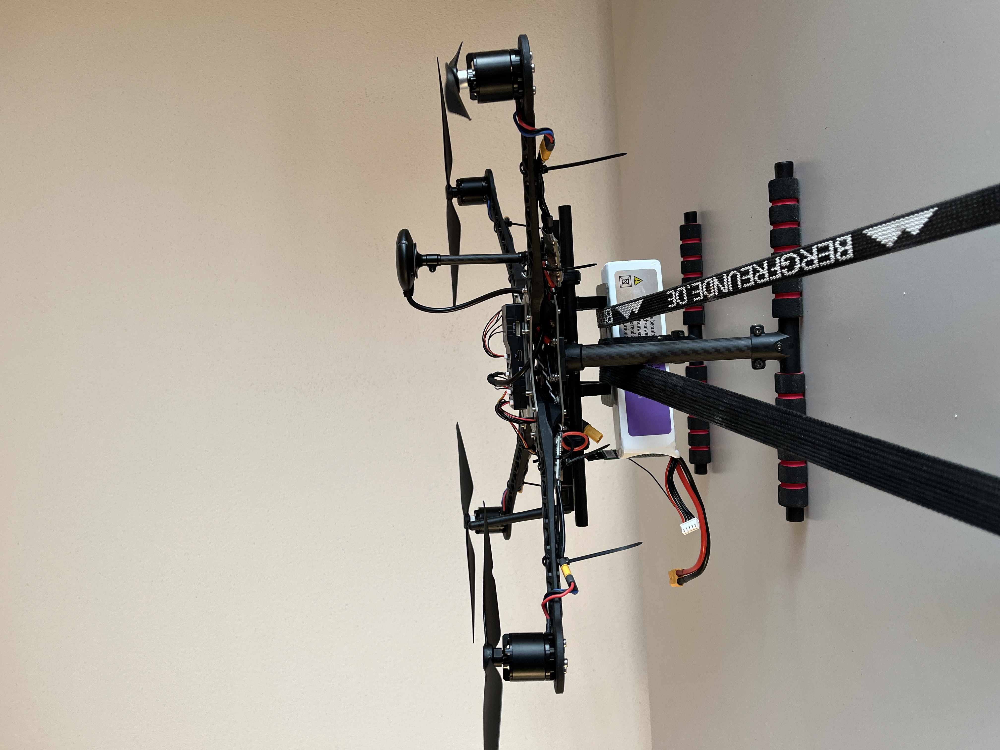
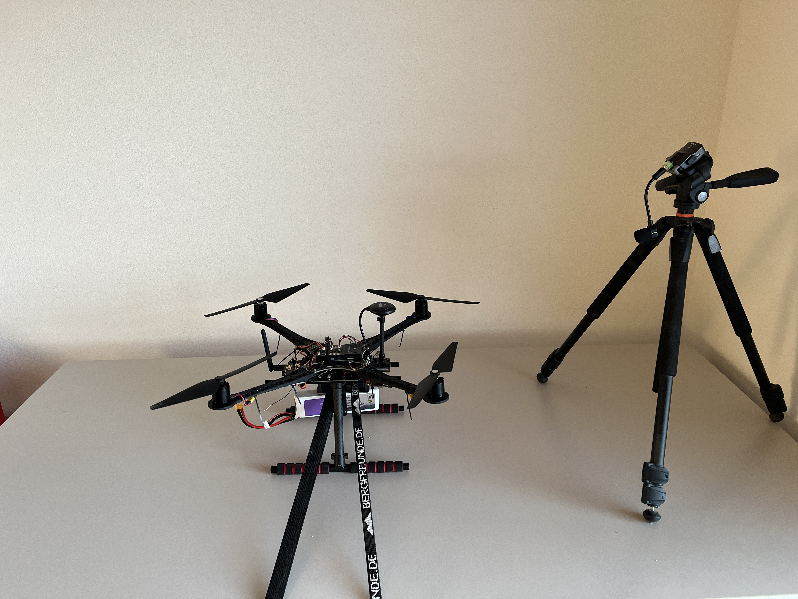

# Passive akustische Drohnendetektion

Erkennung und Klassifikation von Drohnen anhand ihrer **akustischen Rotorsignatur** –
passiv, emissionsfrei und kostengünstig. Ein Systems-Engineering-Portfolioprojekt
im Umfeld Counter-UAS / Missionselektronik.

> **Status: in Arbeit.** Die komplette Signalverarbeitungskette steht und ist an
> synthetischen Referenzdaten (Selbsttests) verifiziert. Die Validierung an einer
> realen Plattform (Holybro S500 / PX4) mit Drehzahl-Ground-Truth ist der nächste
> Schritt (siehe [Roadmap](#roadmap)).



*S500 V2, für die Messung festgezurrt – das vermessene Fluggerät im
Bench-Aufbau. Weitere Fotos der Kette im ICD (`docs/04_physical_architecture/`).*

## Idee

Ein Propeller erzeugt einen periodischen Druckimpuls bei der **Blattfolgefrequenz**
BPF = Blattzahl · RPM / 60. Im Spektrum entsteht dadurch ein regelmäßiger
Harmonischen-**Kamm** – eine Signatur, die sich schwer tarnen lässt, weil sie an der
Antriebsphysik hängt. Wind und Umgebungslärm sind breitbandig und erzeugen keinen
solchen Kamm. Genau diese Struktur trennt Drohne von Störgeräusch.

Passive Akustik ist als kostengünstiger, emissionsfreier C-UAS-Sensor-Layer
operativ etabliert und detektiert insbesondere HF-stille und kleine, RCS-arme
Plattformen, die Radar und funkbasierte Verfahren umgehen.

## Verarbeitungskette

```
Mikrofon → Interface → Audiostrom
   → FFT (gemitteltes Betragsspektrum, Hann-Fenster)
   → HPS (Harmonic Product Spectrum) → Grundton f0 (= BPF)
   → Kamm-Score (harmonische Prominenz) → Detektion (mit Persistenz)
   → Klassifikation (verstimmte Grundtöne → Multikopter vs. Fixed-Wing)
   → Validierung gegen RPM-Ground-Truth (BPF = Blattzahl · RPM / 60)
```

## Struktur

```
.
├── README.md
├── LICENSE
├── requirements.txt
├── .gitignore
├── docs/                             # Arcadia-Ebenen (Bedarf → Lösung → Nachweis)
│   ├── 01_operational_analysis/
│   │   └── capability-concept.md     # OA: Operationslücke, ConOps, Trade-Study
│   ├── 02_system_analysis/
│   │   └── system-requirements.md    # SA: Systemanforderungen mit IDs (SYS-REQ-###)
│   ├── 03_logical_architecture/
│   │   └── logical-architecture.md   # LA: logische Funktionen/Komponenten
│   ├── 04_physical_architecture/
│   │   └── icd.md                    # PA: Systemkontext + Interface Control Document
│   ├── 05_verification/
│   │   └── verification-matrix.md    # V&V: Anforderung → Methode → Kriterium → Ergebnis
│   └── figures/                      # Analyse- und Erklärgrafiken
├── src/
│   ├── acoustic/
│   │   ├── acoustic_logger.py        # Aufnahme (Scarlett), Spektrum, HPS, Pegel-Meter
│   │   ├── comb_detect.py            # Kamm-Score, Detektion, Klassifikation
│   │   └── note.py                   # Frequenz → Notenname (End-to-End-Testhilfe)
│   └── radar/                        # evaluierte Alternative (Micro-Doppler-Radar)
│       ├── tlv_logger.py             # TI-mmWave-TLV-Logger
│       └── micro_doppler.py          # Spektrogramm + BPF-Schätzung
└── tests/
    └── run_selftests.py              # führt alle --selftests aus (ein Aufruf)
```

Die `docs/`-Ebenen folgen der **Arcadia-Methode** (Capella): Operational Analysis →
System Analysis → Logical Architecture → Physical Architecture, ergänzt um die
Verifikation (rechte V-Seite). `src/` ist die Implementierung als *ein* Ast, nicht
der Kern. Ein Capella-Modell (`.capella`) könnte diese Struktur später 1:1 abbilden.

Der Radar-Strang dokumentiert die bewusste Trade-Entscheidung Radar → Akustik
(gleiche Validierungsmethodik, geringere Kosten, schnellerer Weg zum Ergebnis). Dies kann später erfolgen.

## Nutzung

```bash
pip install -r requirements.txt

# Ganze Verarbeitungskette ohne Hardware verifizieren (ein Aufruf)
python tests/run_selftests.py

# Einzelne Selbsttests (aus dem Modulordner)
cd src/acoustic
python comb_detect.py --selftest
python acoustic_logger.py --selftest

# Eingangspegel live einstellen, dann aufnehmen
python acoustic_logger.py --meter
python acoustic_logger.py --record --seconds 20 --out step_6000.wav --rpm 6000

# Analysieren: Detektion, Klasse, Grundton, Abgleich gegen die Drehzahl
python comb_detect.py --analyze step_6000.wav --rpm 6000 --png step_6000_comb.png
```

## Ergebnisse (Stand: Verifikation der Kette)

Die Grundton- und Kammerkennung ist an **synthetischen** Signalen mit bekannter
Wahrheit verifiziert:

- HPS-Grundtonschätzung: rel. Fehler < 1 % gegen bekannte Frequenz
- Kamm-Score trennt Rotor-Signatur (~0,8) klar von breitbandigem Rauschen (~0,1)
- Klassifikation trennt Multikopter (mehrere verstimmte Grundtöne) von Fixed-Wing

> Die Bilder unter `docs/figures/` (`comb_demo.png`, `acoustic_demo.png`,
> `microdoppler_demo.png`) stammen aus **synthetischen Selbsttests**, nicht aus
> Feldmessungen. `fourier_harmonics.png` ist eine Erklärgrafik.

## Validierungsmethode

Ground Truth ist die unabhängig gemessene Drehzahl: optischer Tacho (mechanische
RPM, eine Reflexmarke pro Propeller) bzw. später ESC-Telemetrie (bidirektionales
DShot, ESC benötigt update). Kennzahl: relativer Fehler zwischen gemessenem Grundton und vorhergesagter
BPF = Blattzahl · RPM / 60.

## Roadmap

- [ ] Feldmessung an S500/PX4: Bench mit Drehzahlstufen, dann Hover
- [ ] Ground Truth synchron mitloggen (MAVLink/ESC-RPM, gemeinsamer Zeitstempel)
- [ ] Detektionsreichweite und Falschalarmrate im Freien quantifizieren
- [ ] Mikrofon-Array: Richtungsbestimmung (GCC-PHAT / DoA)
- [ ] Edge-Inferenz (STM32) für einen verteilten Sensor-Knoten
- [ ] Cross-Modalität: Abgleich mit IMU-Vibration und Radar-Micro-Doppler

## Grenzen (ehrlich)

Kurze Reichweite (bricht bei Wind/Lärm ein); keine Entfernung aus einem Einzelmikro
(Array nötig); sehr leise/ummantelte Propeller flachen den Kamm ab. Akustik ist ein
Nahbereichs-/Trigger-Sensor in der Sensorfusion, kein Alleinsensor.

## Lizenz

MIT – siehe [LICENSE](LICENSE).
