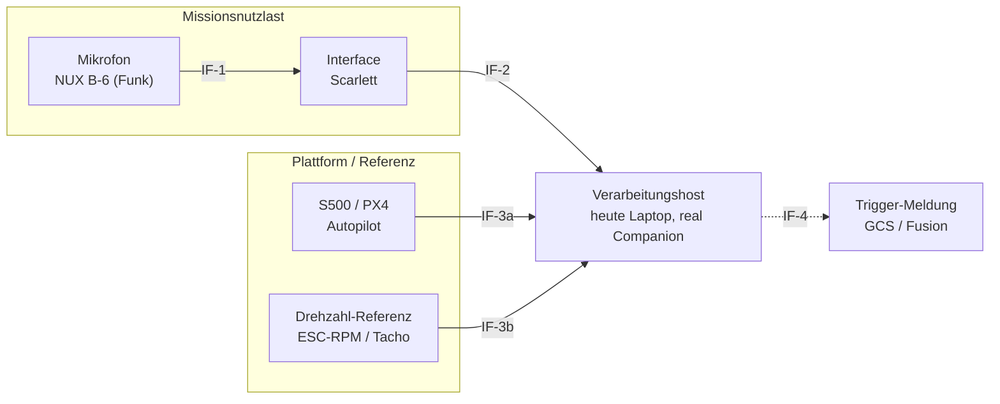
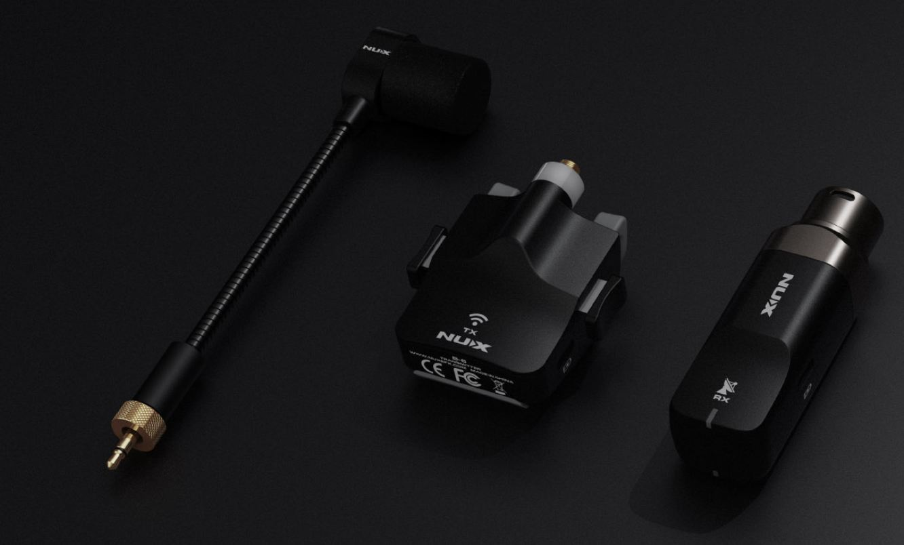
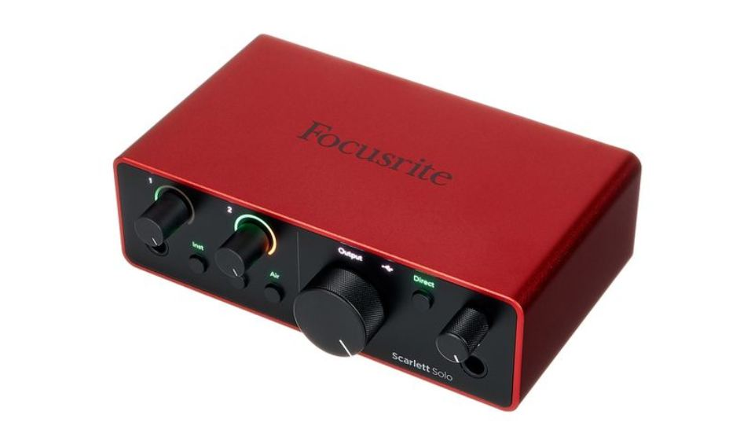

# Interface Control Document (ICD) – Akustischer Detektionsknoten

**Dokument:** 04_physical_architecture / icd
**Bezug:** Systemanforderungen (Dok. 02), insb. SYS-REQ-020/021/022/023

## 1. Systemkontext und Nutzlastgrenze

*Nutzlastgrenze = linker Subgraph. Gestrichelt: IF-4 (Trigger-Ausgabe) ist Roadmap.*

Der Verarbeitungshost spielt die Rolle des Missionsrechners; in einem gefieldeten
System ein Companion Computer. Die Schnittstellen bleiben identisch.

*Sensorseite (**IF-1**): NUX-B-6-Funkmikrofon am Rotor der S500 – Quelle des
Rotorschalls, per 2,4-GHz-Funk zum Empfänger und über XLR/Mikrofonpegel ins Interface.*

*Verarbeitungs-/Bodenseite: Host mit Scarlett-Interface (**IF-2**, USB, 48 kHz) und
Steuer-/Telemetrieanbindung. S500/PX4 liefert die Telemetrie (**IF-3a**); die
Drehzahl-Referenz kommt über Tacho/ESC (**IF-3b**).*

## 2. Schnittstellenübersicht

| ID | Von → Nach | Typ | Zweck |
|---|---|---|---|
| IF-1 | Mikrofon → Interface | analog, Funk + XLR | Rotorschall |
| IF-2 | Interface → Host | USB (UAC) | digitalisiertes Audio |
| IF-3a | Autopilot → Host | MAVLink über SiK 433 | Telemetrie (Zeit, Fluglage) |
| IF-3b | Drehzahl-Referenz → Host | ESC-Telemetrie / opt. Tacho | Ground Truth |
| IF-4 | Host → Netzwerk | UDP/IP (Roadmap) | Trigger-Meldung |
| IF-5 | Versorgung | USB 5 V / Akku | Strom |

## 3. Schnittstellendefinitionen

### IF-1 Mikrofon → Interface
Physisch: 2,4-GHz-Funkstrecke (B-6 Sender→Empfänger), Empfängerausgang XLR,
Mikrofonpegel. Elektrisch: keine Phantomspeisung (Empfänger aktiv/batteriebetrieben).
Signal: 20 Hz–20 kHz, mono. Fehlerfälle: Funkabriss → Signalausfall (im Host als
Pegel ≈ 0 erkennbar).

### IF-2 Interface → Host
Physisch: USB, USB Audio Class. Daten: PCM, ≥ 48 kHz, 24 bit, Kanal 1 (mono).
Der Host wählt das Gerät per Namensfilter („Focusrite"). Erfüllt SYS-REQ-020.

### IF-3a Autopilot → Host (Telemetrie)
Protokoll: MAVLink über SiK-Funk, 433 MHz. Nachrichten (Auswahl):
`ATTITUDE`, `GLOBAL_POSITION_INT`. Rahmen: NED. Einheiten gemäß MAVLink (mm, cdeg …).

### IF-3b Drehzahl-Referenz → Host (Ground Truth)
Variante A (heute): optischer Tacho, **eine Reflexmarke pro Propeller** → mechanische
RPM, manuell je Drehzahlstufe erfasst.
Variante B (später): `ESC_STATUS.rpm` bzw. ULog `esc_status.esc_rpm` via
bidirektionalem DShot; Umrechnung eRPM→RPM über Polzahl (`DSHOT_MOT_POL`, S500/2216 =
14 Pole). Ableitung: BPF = Blattzahl · RPM / 60. Erfüllt SYS-REQ-022.

### IF-4 Host → Netzwerk (Roadmap)
Transport: UDP/IP. Nutzlast (Schema, Entwurf): `{ t_iso, bearing_deg, class,
f0_hz, confidence }`. Rate: ereignisgetrieben. Erfüllt SYS-REQ-023.

### IF-5 Versorgung
Interface über USB 5 V; Mikrofonstrecke über internen Akku.

## 4. Zeitbasis (querschnittlich)

Jede Audioaufnahme trägt einen Host-Zeitstempel (`time.monotonic_ns`) beim
Stream-Start; jeder Sample-Zeitpunkt = t_start + n/fs. Telemetrie/Ground-Truth
werden mit derselben monotonen Uhr gestempelt. Dies ist die gemeinsame Zeitbasis
für die spätere synchrone Fusion. Erfüllt SYS-REQ-021.
